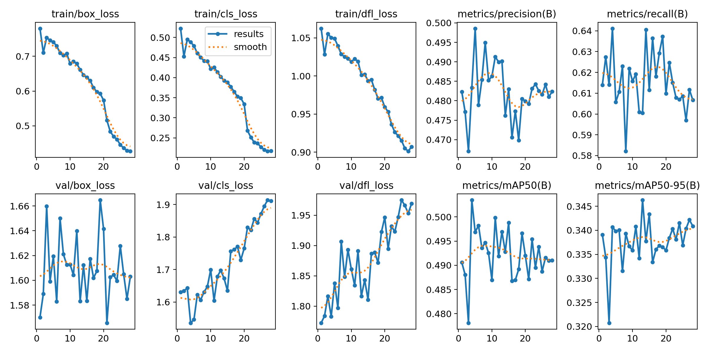

# Gingiva Periodontal Detection System

A deep learning–based system for detecting periodontal conditions from intraoral images.  
The project focuses on medical image analysis, model training, and scalable deployment practices.

## Problem Statement

Periodontal diseases are among the most common oral health problems worldwide. 
Early detection is critical for preventing severe complications. 

This project aims to develop a computer vision model capable of detecting gingival and periodontal conditions from intraoral images using deep learning techniques.

## Project Structure

├── Dataset/                         # Dataset information and related files
├── runs/detect/a/dis_eti_clean/     # Training results and evaluation outputs
├── static/                          # Static files for web interface
├── templates/                       # HTML templates for Flask app
├── app.py                           # Flask application entry point
├── dataset.yaml                     # YOLO dataset configuration
├── main.ipynb                       # Model training notebook
├── requirements.txt                 # Project dependencies
└── README.md                        # Project documentation


## Dataset

The model was trained using the following publicly available dataset:

Mendeley Data:
https://data.mendeley.com/datasets/3253gj88rr/1

The dataset contains annotated intraoral images labeled for periodontal detection. 
Bounding box annotations were used for object detection training.

## Model Architecture

- Model: YOLO-based object detection
- Framework: PyTorch
- Task: Periodontal region detection
- Training environment: Jupyter Notebook

## Technologies Used

- Python
- PyTorch
- YOLO
- OpenCV
- Flask
- Hugging Face Hub


## Training Results

Below are the training and validation metrics obtained during model training:



The model demonstrates stable convergence during training.

- Training losses (box, classification, and DFL) decrease consistently.
- Validation losses remain relatively stable.
- mAP@50 reached approximately 0.49.
- mAP@50-95 reached approximately 0.34.
- Precision ≈ 0.48
- Recall ≈ 0.61

The training and validation curves show generally stable behavior with no severe overfitting observed.

## Model Weights

The trained model weights are hosted on Hugging Face:

https://huggingface.co/Kutay0/gingiva-periodontal-detection

The model is automatically downloaded when running the application.

## Installation

```bash
git clone https://github.com/BerkeKutay/gingiva-project.git
cd gingiva-project
pip install -r requirements.txt


## Future Improvements

- Model performance optimization
- Deployment on cloud platforms
- Real-time inference support
- Clinical validation with expert dentists

## Author

Berke Kutay
Computer Engineering Student | AI & Computer Vision  

